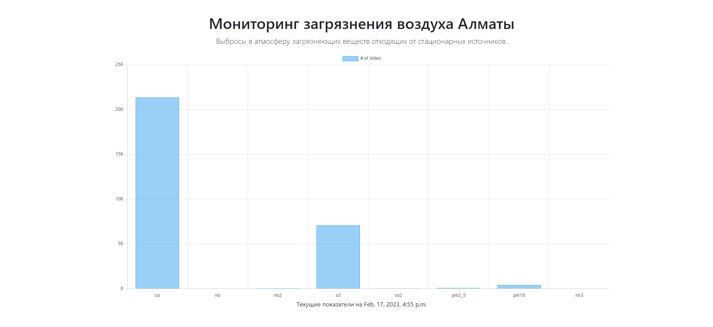

# Автоматический сбор, анализ и визуализация экологических данных



Разработка и моделирование ИС, производящей расчет концентрации загрязняющих веществ в атмосфере города, поступающих от стационарных источников загрязнения, а также расчет комплексного индекса загрязнения атмосферы.

- Автоматизация сбор данных
- Анализ и статистика экологических данных города Алматы
- Визуализация статистики экологических данных

## Использованные технологии

- [Django 3.2] - свободный фреймворк для веб-приложений на языке Python, использующий шаблон проектирования MVC
- [Bootstrap 5.0.2] - свободный набор инструментов для создания сайтов и веб-приложений.
- [Chart.js] - это бесплатная библиотека JavaScript с открытым исходным кодом для визуализации данных, которая поддерживает восемь типов диаграмм
- [Python 3.10.0] - высокоуровневый язык программирования общего назначения с динамической строгой типизацией и автоматическим управлением памятью

## Установка и запуск

1. ```
   https://github.com/batukhan97/air-pollution
   ```
2. ```
   pip install -r requirements.txt
   ```
3. ```
   python manage.py runserver
   ```
> Премичание `В проекте был использован Python 3.10.0`
